# Hive&Spark SQL-Helper

Help you efficiently and focus on Spark SQL(v4.0.0) & Hive(v3.x) development. support Spark & Hive SQL error grammar check, spark sql semantic check, syntax highlighting, complete keywords, rename, find all references and code format.

> If you like develop Spark SQL in IDEA, you can use IDEA version of the plugin——[Spark SQL Helper](https://plugins.jetbrains.com/plugin/26079-spark-sql-helper), Its grammar error message is more powerful and supports all statement.
> Or you like develop Spark SQL in VsCode. i suggest that you develop and debug on vscode based on [the information](https://code.visualstudio.com/docs/java/java-debugging) to obtain a better experience.

---

一款帮助你更高效、专注开发SparkSQL(v4.0.0)、HiveSQL(v3.x)的插件。支持SparkSQL和HiveSQL的语法、语义校验提示、代码高亮、关键字补全、重命名、查找全部引用、代码格式化等。

反馈问题可以直接开issue。用户QQ群：`913711491`，也欢迎关注我公众号一起学习更多的大数据知识。

> 如果你喜欢在IDEA中进行SparkkSQL的开发。我建议你使用[IDEA版的Spark SQL Helper](https://plugins.jetbrains.com/plugin/26079-spark-sql-helper)，它支持了所有语句，在VsCode插件的基础上，它的报错信息也更加清晰。
> 如果你喜欢在VsCode上开发，那么配合[VS Code官网里的Java环境配置](https://code.visualstudio.com/docs/java/java-debugging)也会很棒。

## 1.Features(功能介绍)

### 1.1 Grammar Check

Setting plugin config like

需要开启配置，就像这样：
1. 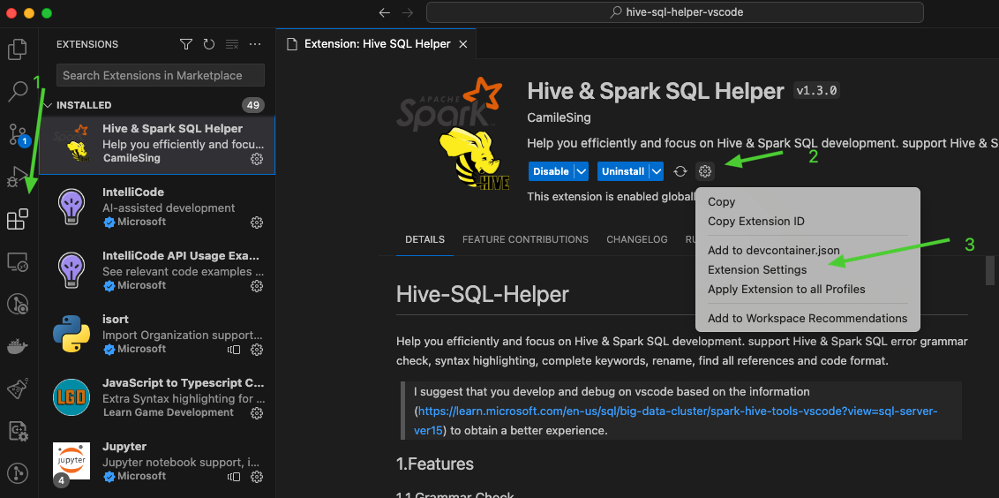
2. 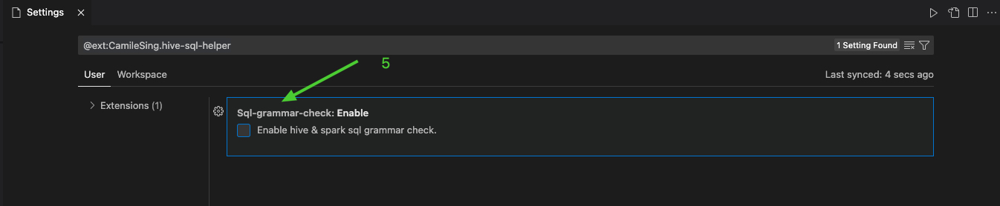

then the plugin will check grammar when you save edit (suggest you turn off automatic saving).

当你保存时，插件会对你的SQL进行语法检查。

example:

例子：

- 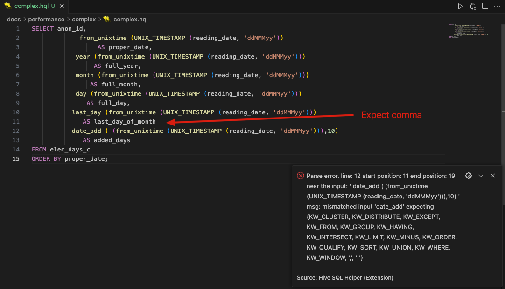
- 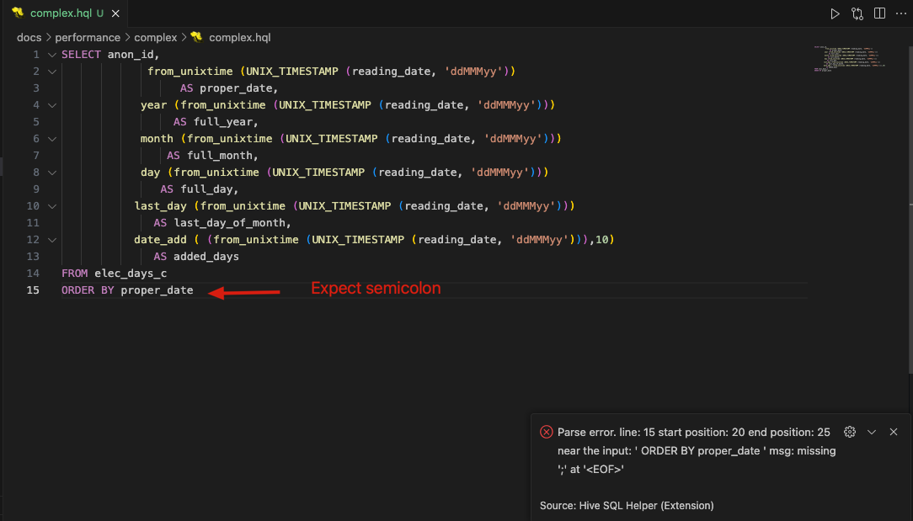

### 1.2 Refactorings(重构)

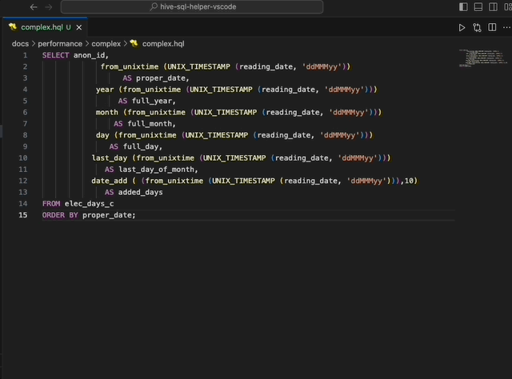

### 1.3 Code Completion Proposals(代码补全)

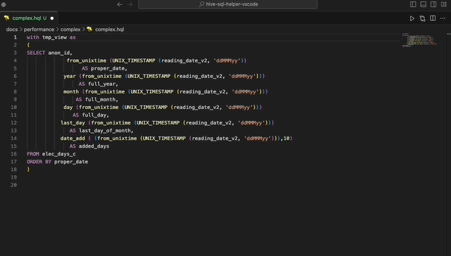

### 1.4 Snippets(快捷代码)

snippets keywords(可触发关键字):

- insert
- create
- alter

#### insert

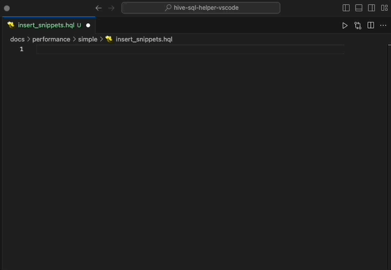

#### create

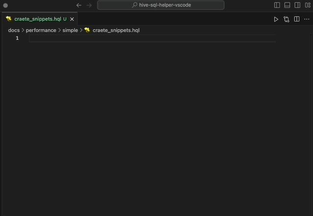

#### alter

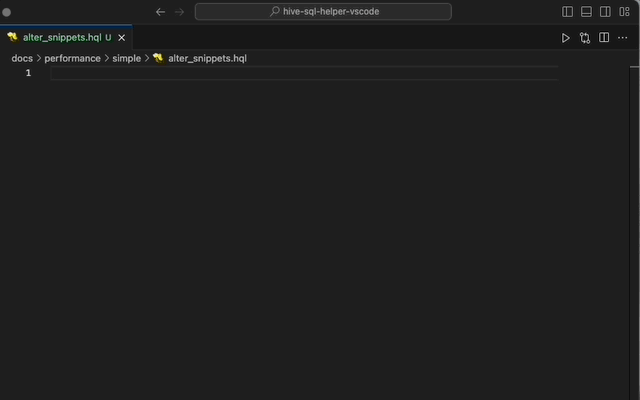

 
### 1.5 Find All References(查找所有的引用)

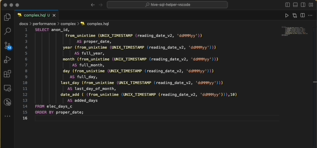

### 1.6 Show References(查找引用)

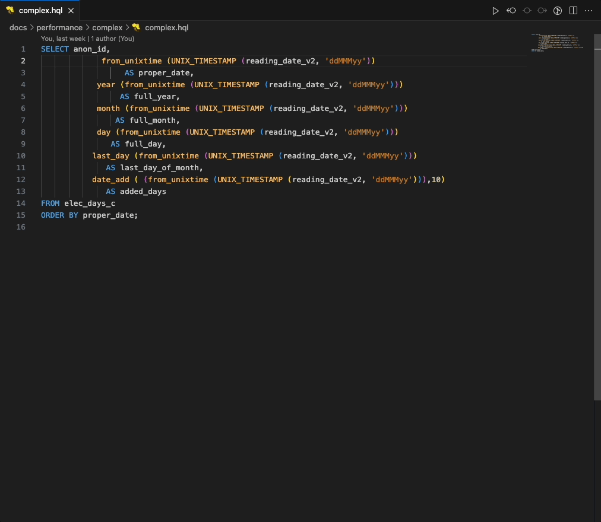

 
### 1.6 Format(格式化)

You can use the right-click menu to format:

你可以右键菜单进行格式化：

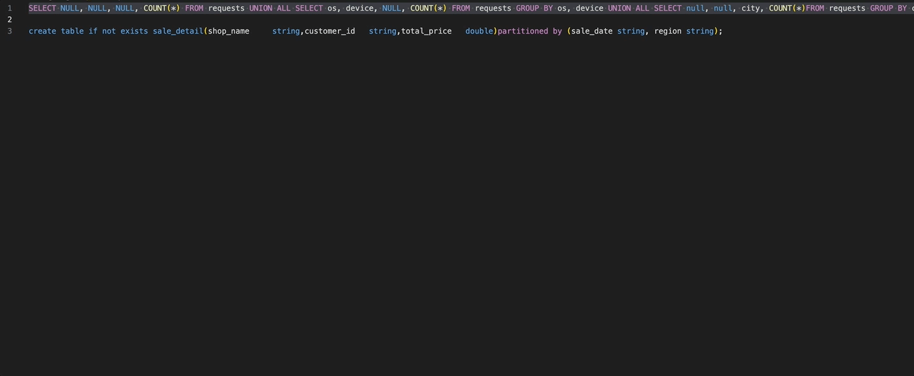

### 2.1 Semantic Check

Setting plugin config like

需要开启配置，就像这样：
1. 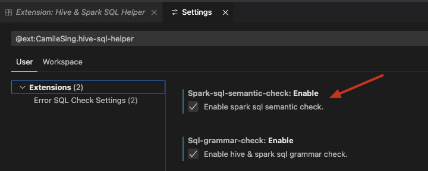
 

then the plugin will check semantic when you save edit (suggest you turn off automatic saving).

当你保存时，插件会对你的SQL进行语义检查。

example:

例子：
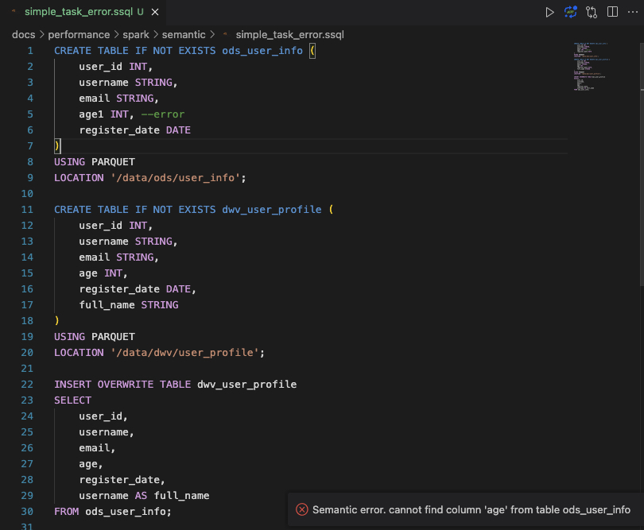

## 2. User Guide(用户手册)

如果你想让插件在你的HiveSQL文件中生效，你的扩展名需要是`.hql` 。如果不想的话，按F1，输入Language Mode，然后选择HiveSQL。

如果你想让插件在你的SparkSQL文件中生效，你的扩展名需要是`.ssql`或`spark_sql`。如果不想的话，按F1，输入Change Language Mode，然后选择SparkSQL。

---

If you want to enable Hive SQL feature on your file, either name the file with a extension `.hql` or `.hive_sql`, Or press F1, type 'Change Language Mode', and then choose HiveSQL.

If you want to enable Spark SQL feature on your file, either name the file with a extension `.ssql` or `.spark_sql`, press F1, type 'Change Language Mode', and then choose SparkSQL.

### 2.1 Color theme recommend(配色建议)
按F1, 选择Preference: Color Theme，然后复制下面的配色进去。

Press F1, choose `Preference: Open User Setting(JSON)` then paste:

~~~json
{
    "editor.tokenColorCustomizations": {
        "textMateRules": [
                {
                    "scope": "keyword.control.hive",
                    "settings": {
                        "foreground": "#559DD6"
                    }
                },
                {
                    "scope": "storage.type.hive",
                    "settings": {
                        "foreground": "#C27432"
                    }
                },
                {
                    "scope": "support.type.hive",
                    "settings": {
                        "foreground": "#C27432"
                    }
                },
                {
                    "scope": "constant.language.hive",
                    "settings": {
                        "foreground": "#C27432"
                    }
                },
                {
                    "scope": "constant.language.hive",
                    "settings": {
                        "foreground": "#F4BE6B"
                    }
                },
                {
                    "scope": "string.quoted.double.hive",
                    "settings": {
                        "foreground":"#F4BE6B"
                    }
                },
                {
                    "scope": "string.quoted.single.hive",
                    "settings": {
                        "foreground": "#C27432"
                    }
                },      
                {
                    "scope": "keyword.operator.arithmetic.hive",
                    "settings": {
                        "foreground": "#F0F400"
                    }
                },
                {
                    "scope": "keyword.operator.relational.hive",
                    "settings": {
                        "foreground": "#F0F400"
                    }
                },
                {
                    "scope": "keyword.operator.logical.hive",
                    "settings": {
                        "foreground": "#F0F400"
                    }
                },
                {
                    "scope": "support.function.udf.complex.hive",
                    "settings": {
                        "foreground": "#F2BC69"
                    }
                },
                {
                    "scope": "support.function.udf.mathematic.hive",
                    "settings": {
                        "foreground": "#F2BC69"
                    }
                },
                {
                    "scope": "support.function.udf.collection.hive",
                    "settings": {
                        "foreground": "#F2BC69"
                    }
                },
                {
                    "scope": "support.function.udf.type-cast.hive",
                    "settings": {
                        "foreground": "#F2BC69"
                    }
                },
                {
                    "scope": "support.function.udf.date.hive",
                    "settings": {
                        "foreground": "#F2BC69"
                    }
                },
                {
                    "scope": "support.function.udf.conditional.hive",
                    "settings": {
                        "foreground": "#F2BC69"
                    }
                },
                {
                    "scope": "support.function.udf.string.hive",
                    "settings": {
                        "foreground": "#F2BC69"
                    }
                },
                {
                    "scope": "support.function.udf.masking.hive",
                    "settings": {
                        "foreground": "#F2BC69"
                    }
                },
                {
                    "scope": "support.function.udf.misc.hive",
                    "settings": {
                        "foreground": "#F2BC69"
                    }
                },
                {
                    "scope": "support.function.udaf.hive",
                    "settings": {
                        "foreground": "#F2BC69"
                    }
                },
                {
                    "scope": "support.function.udtf.hive",
                    "settings": {
                        "foreground": "#F2BC69"
                    }
                }

                                {
                    "scope": "keyword.control.spark",
                    "settings": {
                        "foreground": "#559DD6"
                    }
                },
                {
                    "scope": "storage.type.spark",
                    "settings": {
                        "foreground": "#C27432"
                    }
                },
                {
                    "scope": "support.type.spark",
                    "settings": {
                        "foreground": "#C27432"
                    }
                },
                {
                    "scope": "constant.language.spark",
                    "settings": {
                        "foreground": "#C27432"
                    }
                },
                {
                    "scope": "constant.language.spark",
                    "settings": {
                        "foreground": "#F4BE6B"
                    }
                },
                {
                    "scope": "string.quoted.double.spark",
                    "settings": {
                        "foreground":"#F4BE6B"
                    }
                },
                {
                    "scope": "string.quoted.single.spark",
                    "settings": {
                        "foreground": "#C27432"
                    }
                },      
                {
                    "scope": "keyword.operator.arithmetic.spark",
                    "settings": {
                        "foreground": "#F0F400"
                    }
                },
                {
                    "scope": "keyword.operator.relational.spark",
                    "settings": {
                        "foreground": "#F0F400"
                    }
                },
                {
                    "scope": "keyword.operator.logical.spark",
                    "settings": {
                        "foreground": "#F0F400"
                    }
                },
                {
                    "scope": "support.function.udf.complex.spark",
                    "settings": {
                        "foreground": "#F2BC69"
                    }
                },
                {
                    "scope": "support.function.udf.mathematic.spark",
                    "settings": {
                        "foreground": "#F2BC69"
                    }
                },
                {
                    "scope": "support.function.udf.collection.spark",
                    "settings": {
                        "foreground": "#F2BC69"
                    }
                },
                {
                    "scope": "support.function.udf.type-cast.spark",
                    "settings": {
                        "foreground": "#F2BC69"
                    }
                },
                {
                    "scope": "support.function.udf.date.spark",
                    "settings": {
                        "foreground": "#F2BC69"
                    }
                },
                {
                    "scope": "support.function.udf.conditional.spark",
                    "settings": {
                        "foreground": "#F2BC69"
                    }
                },
                {
                    "scope": "support.function.udf.string.spark",
                    "settings": {
                        "foreground": "#F2BC69"
                    }
                },
                {
                    "scope": "support.function.udf.masking.spark",
                    "settings": {
                        "foreground": "#F2BC69"
                    }
                },
                {
                    "scope": "support.function.udf.misc.spark",
                    "settings": {
                        "foreground": "#F2BC69"
                    }
                },
                {
                    "scope": "support.function.udaf.spark",
                    "settings": {
                        "foreground": "#F2BC69"
                    }
                },
                {
                    "scope": "support.function.udtf.spark",
                    "settings": {
                        "foreground": "#F2BC69"
                    }
                }
        ],
    }
}
~~~

我们提供了很多个选项，可以让开发者更好的定制自己的主题。如果你对主题有更多需求，可以查看 syntaxes/*.tmLanguage.json 来了解关键字和配色映射。

We provide so many options to allow developers to better customize their favorite themes. if you want to deep in, please see the syntaxes/*.tmLanguage.json to understand keyword and color theme mapping.
