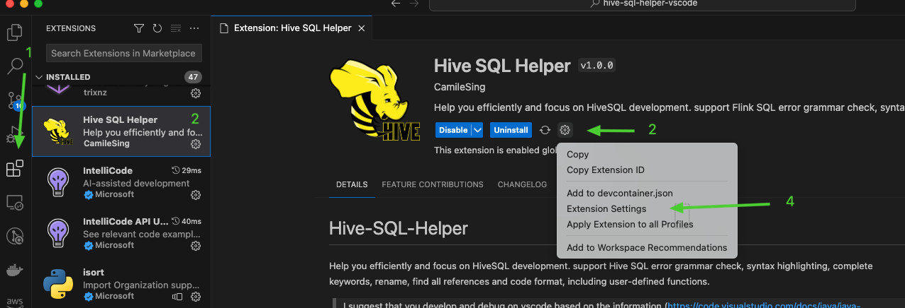
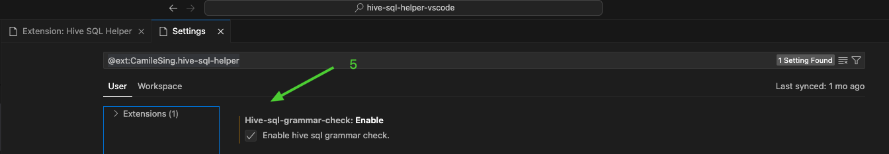

# Hive-SQL-Helper

Help you efficiently and focus on HiveSQL development. support Hive SQL error grammar check, syntax highlighting, complete keywords, rename, find all references.

> I suggest that you develop and debug on vscode based on the information (https://learn.microsoft.com/en-us/sql/big-data-cluster/spark-hive-tools-vscode?view=sql-server-ver15) to obtain a better experience.

## 1.Features

### 1.1 Grammar Check

Setting plugin config like
1. 
2. 

then the plugin will check grammar when you save edit (suggest you turn off automatic saving).

example:

- 
- 

### 1.2 Refactorings

### 1.3 Code Completion Proposals

### 1.4 Snippets

snippets keywords:

- insert
- create
- alter

#### insert

#### create

#### alter

 
### 1.5 Find All References

 
## 2. User Guide

Enable the extension on your file, either name the file with a extension `.HQL`.
  
Or press F1, type 'Change Language Mode', and then choose HiveSQL.
